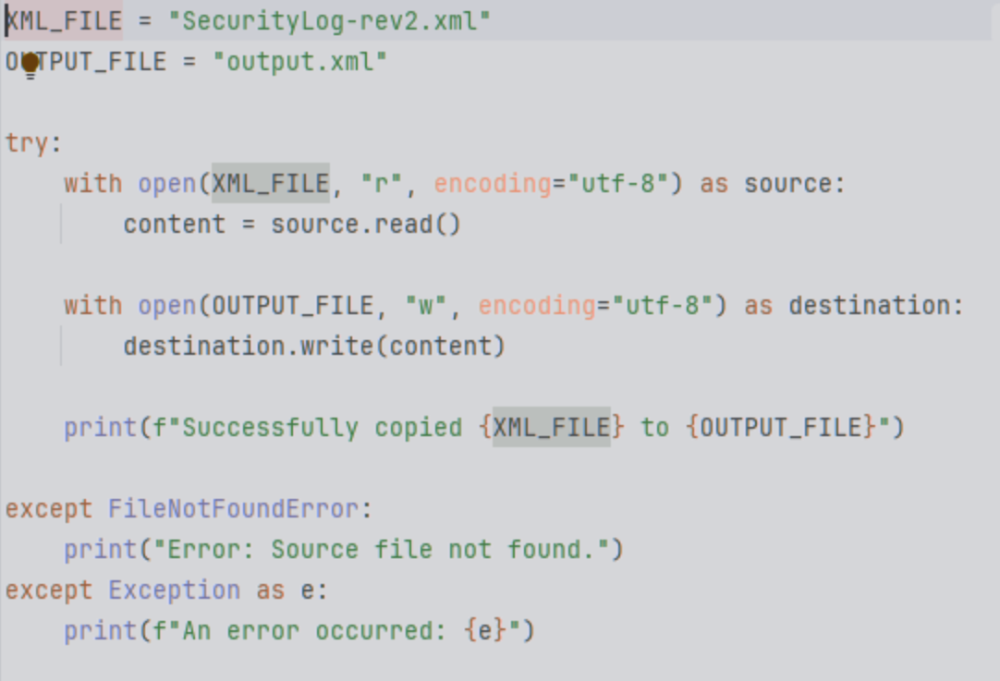
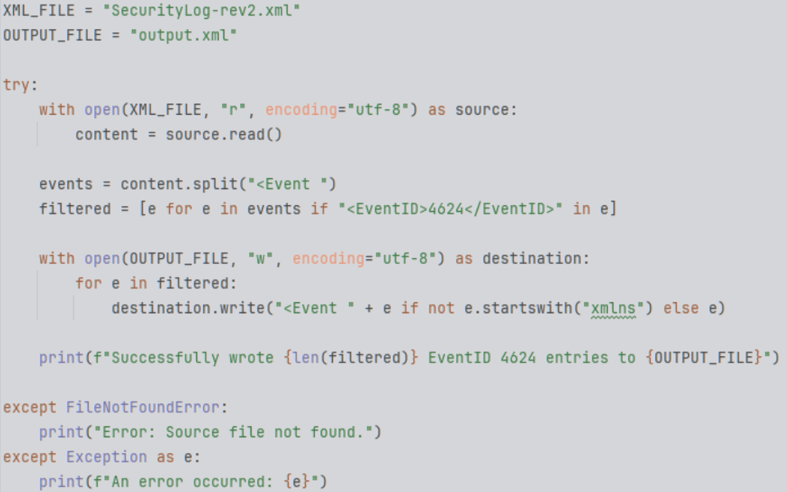

<h1>Uncovering Suspicious Activity in 80,000 Logs</h1>

<h2>Description</h2>
In the past, I've briefly examined the Security Logs section in Windows Event Viewer for other projects, but I've never gone as in-depth as I did with this project. My professor presented us with a Windows Security Log file with 80,000 entries and little direction. Although I was intimidated at first, I knew I wouldn't be able to do this project without some extra help. My key takeaway from this project: life becomes much easier when you write a short Python script to do all the heavy lifting for you.
 

<h2>Languages and Utilities Used</h2>

- <b>Python 3
- Windows Security Logs</b> 

<h2>Environments Used </h2>

- <b>PyCharm
- Windows 10 VM (UTM)</b> 

<h2>BLUF (Bottom Line Up Front)</h2>
This is an analysis of a Windows Security Log that contains approximately 80,000 events over 24 hours, 155 distinct users, and two indicators of compromise. Two main indicators of compromise were abnormal user logon patterns and suspicious failed logon attempts. While these are not inherently malicious, their presence poses a risk that warrants further investigation. Analysis of this security log revealed logons during all hours of the day for users Grant Larson and Matt Edwards. This could indicate compromised credentials or automated activity, which could be a breach of security and policy. Two failed login attempts from the 127.0.0.1 IP address (Event ID 4625) will require additional information. Users who used the machine at 127.0.0.1 around 15:00 UTC on April 15th, 2011, must be evaluated to determine whether the traffic was generated by legitimate administrators or bad actors. 

<h2>Documentation:</h2>
<ul>
  <li><b><a href="./Windows%20Security%20Log%20Analysis%20(2).pdf">View the PDF</a></b></li>
</ul>

<h2>Simple Read/Write Python Script:</h2>

  

<h2>Modified Python Script to Target EventID 4625:</h2>

  

